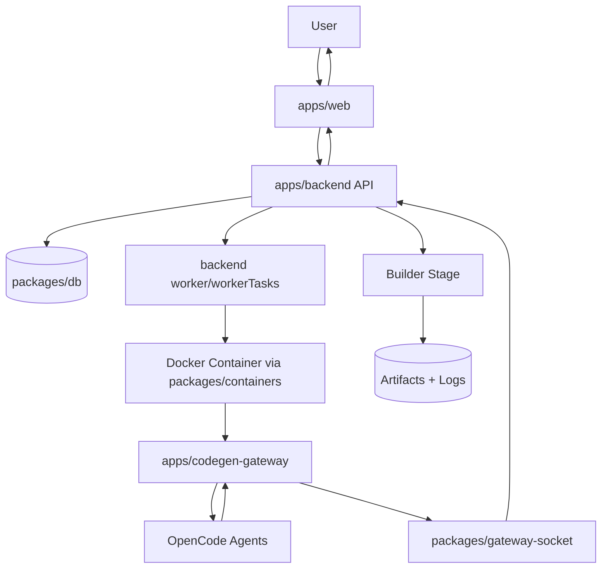

# Apptly - The AI Mobile App Creator

The goal of this project is to create a simple, mobile first, web application that allows creation of simple mobile applications (targeting Android) without any programming knowledge.
The project is still early and I am working towards it.
Right now the focus is on self-hosting. It's not ideal for real users but it's where we want to start to see the project validated.
Due to architectual decisions, the first release of this project will only be able to run self-hosted.

Note about vibe-coding: I've included some basic agent skills  but right now no line of code is generated by AI. I plan to later in the development, but I want to get a good understanding of the problem at the early stage.

## Architecture

Apptly is a self-hosted monorepo with three runtime roles: **Web UI**, **Backend Orchestrator**, and **Codegen Gateway containers**.

### Runtime components

- **`apps/web` (Frontend)**
  - Vite web app for project creation and generation control.
  - Talks to backend over HTTP/WebSocket.

- **`apps/backend` (API + Orchestration)**
  - Receives user requests.
  - Persists state via `packages/db`.
  - Schedules async work via `worker` / `workerTasks`.
  - Manages container lifecycle through `packages/containers`.
  - Streams/relays generation events.

- **`apps/codegen-gateway` (inside spawned container)**
  - Entry process for code generation jobs.
  - Spawns and controls OpenCode agents (`agent.ts`, `agentGenerateService.ts`, `agentAbortService.ts`).
  - Reports progress/results back through gateway socket transport.

- **Builder stage**
  - Runs after generation to produce build artifacts (APK/AAB pipeline).
  - Build status/logs are persisted and returned to users.

### Shared packages

- **`packages/containers`**: Docker/container abstraction used by backend.
- **`packages/gateway-socket`**: backend ↔ gateway communication channel.
- **`packages/db`**: Drizzle schema/migrations/data access.
- **`packages/auth`**: authentication utilities.

### End-to-end flow

1. User starts generation from Web UI.
2. Backend validates request and creates a generation run record.
3. Backend worker starts an isolated Docker container.
4. Container boots `codegen-gateway`.
5. Gateway spawns OpenCode agent(s) for planning/generation.
6. Agent events stream back to backend (status, logs, outputs).
7. Generated source is finalized and handed to builder stage.
8. Builder produces artifacts/logs.
9. Backend exposes run status and downloadable artifacts to the UI.

### Flow diagram



## Building

There are no build scripts yet as I'm only working on backend right now. The full step to run development backends are as follow.
First, copy .env.example to .env and fill variables

```sh
bun i
docker compose up -d
bun run db-setup && bun run seed
bun run dev:backend
```

You also need to build image for spawned containers (apps/codegen-gateway)

```shell
docker build -t apptly-codegen -f apps/codegen-gateway/Dockerfile.codegen 
```
